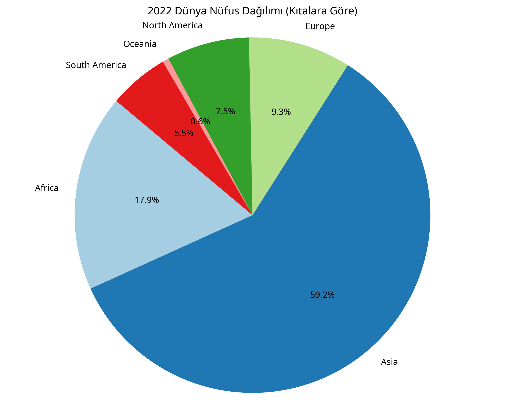

# 🚀 Veri Analizi ve Görselleştirme Portfolyosu

Bu depo, Python kullanarak gerçekleştirdiğim çeşitli veri analizi, veri madenciliği ve interaktif görselleştirme projelerini içermektedir. Her bir proje, gerçek dünya veri setleri üzerinde derinlemesine incelemeler sunar.

## 📂 Mevcut Projeler

Şu an depoda bulunan analiz çalışmaları aşağıda listelenmiştir:

### 1. 📊 Öğrenci Sınav Performansı Analizi (`box-chart.ipynb`)
- **Açıklama:** Kaggle üzerindeki "Students Performance in Exams" veri seti kullanılarak öğrencilerin akademik başarıları incelenmiştir.
- **Odak Noktası:** Matematik notlarının dağılımı ve istatistiksel özetleri.
- **Teknikler:** Box Plot (Kutu Grafiği), Pandas, Plotly Express.

### 2. 📈 Aylık Satış Trendleri Analizi (`line-chart.ipynb`)
- **Açıklama:** Bir perakende şirketinin yıllık satış verileri üzerinden aylık performans trendleri analiz edilmiştir.
- **Odak Noktası:** Satışlardaki mevsimsel değişimler ve en yüksek kazanç sağlanan aylar.
- **Teknikler:** Line Chart (Çizgi Grafik), Veri Temizleme, Pandas, Matplotlib.

### 3. 🎻 Müşteri Segmentasyonu ve Harcama Analizi (`violin-plot.ipynb`)
- **Açıklama:** "Mall Customers" veri seti kullanılarak müşteri demografisi ve harcama alışkanlıkları analiz edilmiştir.
- **Odak Noktası:** Cinsiyet ve yaş gruplarına göre yıllık gelir ve harcama skorlarının yoğunluk dağılımı.
- **Teknikler:** Violin Plot (Keman Grafiği), Seaborn, Pandas, Matplotlib.

### 4. 🥧 Dünya Nüfus Dağılımı Analizi (`pie-chart.ipynb`)
- **Açıklama:** Dünya nüfus veri seti kullanılarak kıtalara göre nüfus dağılımı incelenmiştir.
- **Odak Noktası:** 2022 yılı verilerine göre kıtaların toplam nüfus içerisindeki payları.
- **Teknikler:** Pie Chart (Pasta Grafiği), Pandas, Matplotlib.
- **Görsel Çıktı:**
  

---

## 🛠️ Kullanılan Genel Teknolojiler

Projelerin genelinde aşağıdaki Python kütüphaneleri aktif olarak kullanılmaktadır:

| Kütüphane | Kullanım Amacı |
| :--- | :--- |
| **Pandas** | Veri manipülasyonu ve analizi. |
| **NumPy** | Bilimsel hesaplamalar. |
| **Matplotlib / Seaborn** | Statik veri görselleştirme. |
| **Plotly** | Etkileşimli ve dinamik grafikler. |
| **Jupyter Notebook** | İnteraktif geliştirme ortamı. |

## 💻 Kurulum ve Kullanım

1. Depoyu yerel makinenize klonlayın:
   ```bash
   git clone https://github.com/zeycanaslan/student-performance-analysis.git
   ```
2. Gerekli kütüphaneleri yükleyin:
   ```bash
   pip install pandas numpy matplotlib seaborn plotly notebook
   ```
3. İlgili `.ipynb` dosyasını Jupyter Notebook veya VS Code üzerinden açarak çalıştırın.

---
📫 **İletişim:** Herhangi bir soru veya iş birliği teklifi için profilim üzerinden bana ulaşabilirsiniz.

*Bu depo Zeycan Aslan tarafından sürekli güncellenmektedir.*
